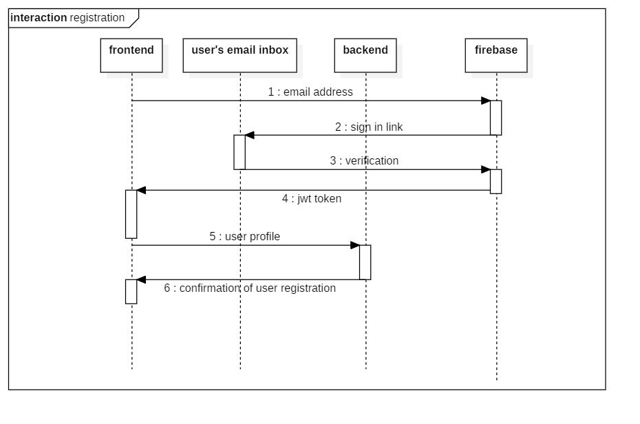

# Technical Design

### Table of contents

1. [Software architecture](#Software-architecture)
2. [Component hierachy](#Component-hierachy)
3. [Sockets](#Sockets) 
    * [How it works](##How-it-works)
    * [Comparing libraries](##Comparing-libraries)
    * [Benchmark](##Benchmark)
    * [Server adjustments](##Server-adjustments)
    * [Benchmark results](##Benchmark-results)
    * [Implementation](##Implementation)
4. [Database](#Database)
5. [Api](#Api)
6. [Nodemailer](#Nodemailer)
7. [Uniqolor](#Uniqolor)
8. [Authentication](#Authentication)
9. [Dataloader](#Dataloader)


# Software architecture


**Presentation layer**

There are parts present in the presentation layer such as components, guards, interceptors and models. The guards monitor a route and are used to allow or deny access to a specific route. Consider, for example, logging in, if a user is not logged in, he should not be able to access the pages intended for users who are logged in.
The interceptors are used to modify the outgoing requests, in this case by adding an authentication code to the header of the request, when the user is logged in. This gives the application access to data from the server.

Furthermore, the presentation layer also contains services, with these services requests can be sent to the routes in the service layer and there are also models present, these models are used to handle the typing in typescript and they are identical to the models in the data access layer.

**Service layer** 

The service layer consists mostly of nodeJS routes, Routes are used to forward requests to the corresponding controllers, controllers are explained better in the next layer.
There is also swagger functionality in the service layer, which generates OpenAPI 2.0 specification. These specifications are used to describe APIs.
The service layer also contains an auth module, this is a module with which the routes are secured. Namely, an authentication code in the header is sent along by the interceptor in the presentation layer. The auth module checks the authentication code and then the request is forwarded to the route, if the code is approved and if it is not approved, the request is rejected.
The service layer also contains a socket module, this module contains all functionality related to the sockets, more information about the operation of these sockets can be found in chapter Online collaboration.

**Data access layer**

The data access layer is the connection between the mongoDB database and service layer. The routes from the service layer will forward requests to the controllers in the data access layer, so that these requests can be handled and a response can be returned.


# Sockets
## How it works

**Joining workspace**  


if a user wants to open a workspace, there will be a check if the cluster exists. if it exists a user will join the cluster. if it not exists then it will create the cluster and join it.

**Updating workspace**  


now that the user is connect to a cluster. the user can make changes to a workspace. these changes will be updates in the database and the changes will be sent to the other users that are connected.

Below there will be more information:


so in this workspace 4 groupmembers are active. if user 1 will make a change to the workspace. it will emit the change and a broadcast will be performed and the change will be sent to all other member within the cluster.

if the recieving end fails to recieve the change, it will resend the change to that user only.

**Leave workspace**  


if a user wants to leave a workspace, they can do that by using different means: logging out, switching page, or leave the website. if a user uses any of these forms, the cluster will be left, if he is the last user within the workspace it will also remove the cluster.
## Comparing libraries

|    Desired Functionality     |      WS         | Socket .io    |    SockJS       | Socket Cluster    |
|:----------------------------:|:---------------:|:------------:|:---------------:|:-----------------:|
|         Websockets           |       YES       |      YES     |       YES       |        YES        |
|        Broadcasting          |       YES       |      YES     |       YES       |        YES        |
|      ability to cluster      |        NO       |      YES     |        NO       |        YES        |
|  Broadcasting to Cluster     |        NO       |      YES     |        NO       |        YES        |
|    Lifecycle callbacks       |        NO       |      YES     |       YES       |        YES        |
| Multiple transport types*    |        NO       |      YES     |       YES       |         NO        |
|     Fallback options*        |        NO       |      YES     |       YES       |         NO        |
|      Load balancing*         |        NO       |      YES     |       YES       |        YES        |
|         Debugging*           | YES (Dev tools) |      YES     | YES (Dev tools) |  YES (Dev tools)  |

So based on the results coming from the comparison above, we choose to benchmark socket.io

<br /><br />  

|   Desired functionality   |                                                     Description                                                    |
|:-------------------------:|:------------------------------------------------------------------------------------------------------------------:|
|         Websockets        |           This a required transport type, that establishes a connection en keep a long-lasting connection          |
|        Broadcasting       |                                 This is used to sent 1 message to multiple sockets.                                |
|     Ability to cluster    |                                     This is used to cluster, sockets together.                                     |
|  Broadcasting to cluster  |                        This is used to sent 1 message to multiple sockets within a cluster.                        |
|    Lifecycle callbacks    |    This are callbacks that are connected to the lifecycle of a connection, examples are: "connected", "closed".    |
| Multiple transport types* |                              multiple transport types can be used within the fallback.                             |
|     Fallback options*     |                  This can be implemented to automatically fall back on a different transport type                  |
|      Load balancing*      | load balancing is used to devided connections over multiple servers. This can be used in the future for expansion. |
|         Debugging*        |                            additional debug options make it easier to debug the problem.                           |


## Benchmark
To test the chosen socket library, we chose to perform a benchmark test. This test is based on the following scenario:

* A project group has an average of 5 members, this is based on HBO-IT and SSS projects.
* A students need approximately 5 seconds to perform an action (typing, dragging objects, placing object, etc.)

**Disclaimer: these are estimations**

The scenario described above, will be used to perform the following test scenarios:

* 100 sockets and all clusters will send a message
* 1000 sockets and all clusters will send a message
* 5000 sockets and all clusters will send a message
* 10000 sockets and all clusters will send a message
* 10000 sockets and 10% of the clusters will send a message
* 10000 sockets and 25% of the clusters will send a message
* 10000 sockets and 50% of the clusters will send a message
* 10000 sockets and 75% of the clusters will send a message

During these the following information will be collected each second while the benchmark runs:

* Amount of active clusters
* Messages send each second for each cluster
* Messages recieved each second for each cluster
* Messages send each second for each socket
* Messages recieved each second for each socket
* CPU usage in percentage
* Memory usage in percentage

The message that will be sent during the test will be a 6KB JSON object of an example workspace, That is filled with 4 groups, 3 arrows and 10 cards.

## Server adjustments
Before the benchmark test could be executed there were a couple of server adjustments that were necassery to handle sockets properly.

**Old server**

| Property |          Value          |
|:--------:|:-----------------------:|
|    CPU   | Intel Xeon Silver 4114s |
|    GPU   |  VMware SVGA II Adapter |
|   Cores  |      1 Single Core      |
|    RAM   |           1 GB          |

**New server**

| Property |          Value          |
|:--------:|:-----------------------:|
|    CPU   | Intel Xeon Silver 4114s |
|    GPU   |  VMware SVGA II Adapter |
|   Cores  |      4 Single Core      |
|    RAM   |           8 GB          |


## Benchmark results

|              Testscenario             | Total amount of sent and recieved messages <br /> each second |
|:-------------------------------------:|:-------------------------------------------------------:|
|           100 active sockets          |                           3600                          |
|          1000 active sockets          |                           3301                          |
|          5000 active sockets          |                           3226                          |
|          10000 active sockets         |                           1019                          |
| 1000 active and 9000 inactive sockets |                           2882                          |
| 2500 active and 7500 inactive sockets |                           3049                          |
| 5000 active and 5000 inactive sockets |                           3228                          |
| 7500 active and 2500 inactive sockets |                           2620                          |

<br />

|              Testscenario             | Total amount of sent and recieved messages <br /> each second for each socket |
|:-------------------------------------:|:-----------------------------------------------------------------------:|
|           100 active sockets          |                                   177                                   |
|          1000 active sockets          |                                    16                                   |
|          5000 active sockets          |                                   2.2                                   |
|          10000 active sockets         |                                   0.5                                   |
| 1000 active and 9000 inactive sockets |                                    15                                   |
| 2500 active and 7500 inactive sockets |                                   6.5                                   |
| 5000 active and 5000 inactive sockets |                                    3                                    |
| 7500 active and 2500 inactive sockets |                                   1.3                                   |

<br />

|              Testscenario             | Average CPU usage | Average Memory usage |
|:-------------------------------------:|:-----------------:|:--------------------:|
|           100 active sockets          |        6.9%       |          1%          |
|          1000 active sockets          |       12.8%       |         4.4%         |
|          5000 active sockets          |       16.1%       |          13%         |
|          10000 active sockets         |       25.2%       |         20.1%        |
| 1000 active and 9000 inactive sockets |       16.2%       |         9.9%         |
| 2500 active and 7500 inactive sockets |       17.2%       |         13.4%        |
| 5000 active and 5000 inactive sockets |       18.3%       |         16.9%        |
| 7500 active and 2500 inactive sockets |       20.6%       |         20.8%        |

## Implementation

**Socket server**
```
const server = app.listen(port, () =>
  console.log(`Example app listening on port ${port}!`)
);
const io = require("socket.io")(server);
```
the socket.io library uses a instance of the express server to create a socket server.

Once a socket is connect they can create a listener like:

**Listener**
```
io.on("connection", (socket) => {

});
```
Within this listener, listeners upon the socket can be created like:

```
socket.on("moveGroup", (event) => {
    socket.to(event.room).emit("moveGroup", event.data);
});
```
This listener listens to the event "moveGroup". Once a message has been recieved within the listener is will be resent to all sockets within the room.

**Possible events**

|             Event             |                             Description                             |
|:-----------------------------:|:-------------------------------------------------------------------:|
|           moveGroup           |   this event sents a group with a new location to the other users   |
|        updateGroupTitle       |  this event sents a group with a new group title to the other users |
|      updateWorkspaceTitle     |   this event sents a workspace with a new title to the other users  |
|      updateWorkspaceGoal      |   this event sents a workspace with a new goal to the other users   |
|       addCardToSpawnlist      |              this event sents a card to the other users             |
|        moveCardToGroup        |              this event sents a card to the other users             |
|      addGroupToWorkspace      |           this event sents a new group to the other users           |
|      addArrowToWorkspace      |           this event sents a new arrow to the other users           |
|     updateQuestionInGroup     |        this event sents a updated question to the other users       |
| updateCardPositionWithinGroup |          this event sents a updates list to the other users         |
|   updateQuestionInSpawnlist   |        this event sents a updated question to the other users       |
|      removeCardFromGroup      |         this event sents a card to remove to the other users        |
|    removeCardFromSpawnlist    |         this event sents a card to remove to the other users        |
|   updateNoteInSpawnlistCard   |              this event sents a card to the other users             |
|     updateNoteInGroupCard     |              this event sents a card to the other users             |
|          removeGroup          |        this event sents a group to remove to the other users        |
|        setEffectOnGroup       |   this event sents a group to put an effect on to the other users   |
|     removeEffectFromGroup     | this event sents a group to remove an effect off to the other users |
|        setEffectOnCard        |    this event sents a card to put an effect on to the other users   |
|      removeEffectFromCard     |  this event sents a card to remove an effect off to the other users |
|        setEffectOnTitle       |    this event sents color to put on the title to the other users    |
|     removeEffectFromTitle     |     this event removes the color off a title to the other users     |
|        setEffectOnGoal        |     this event sents color to put on the goal to the other users    |
|      removeEffectFromGoal     |      this event removes the color off a goal to the other users     |
|          connectRoom          |               this event connects the socket to a room              |
|           leaveRoom           |            this event disconnects the socket from a room            |
|        closeConnection        |                     this event closes the socket                    |

# Database


**Card**  

* **id**   
The id is used to make cards unique on the workspace, this is necassery to apply effects in case of online collaboration.
* **shortDescription**   
This is a short description, to explain a card.
* **longDescription**   
This is a long description, to explain a card in more detail.
* **type**   
This value represents the card type
* **note**   
Notes are kept so that a user can add on additional information
* **picture**   
This is the picture that is displayed on the card
* **color**   
This is the color of the card
* **reflectiveQuestions**   
These are the reflective questions that each card has

**Deck**

* **title**   
This is the title of a deck
* **shortDescription**   
This is a short description for the deck
* **types**   
These are the inner-types each deck contains

**User**

* **uid**   
This is the uid of the firebase account that makes a user unique
* **firstName**   
The firstname of the user
* **lastName**   
The lastname of the user
* **email**   
The email of the user
* **school**   
The school the user goes to
* **study**   
The study the user follows at the school

**Template**

* **groups**  
These are the groups/phases that are in a template  
* **storedLines**   
These are the lines that are in a template
* **title**  
This is the title of a template 
* **goal**   
this is the goal of a template
* **image**   
this is the image of a template
* **spawnList**   
this is the spawnlist of a template
* **customCards**   
this a list of custom cards in a template
* **decks**   
this is a list of all decks active in a template

**Workspace**
* **groups**  
These are the groups/phases that are in a workspace   
* **storedLines**   
These are the lines that are in a workspace
* **users**   
this is a list of the users that have permission to get access to the workspace
* **title**   
this is the title of a workspace
* **goal**   
this is the goal of a workspace
* **image**   
this is the image of a workspace
* **spawnList**   
this is the spawnlist of a workspace
* **customCards**   
this a list of custom cards in a workspace
* **decks**   
this is a list of all decks active in a workspace


# Api

More information about the API can be found on: <a href="http://localhost:13788/api-docs/#/">api documentation</a>

The api documentation is generated by express-oas-generator, the server has to be on.

# Nodemailer

```
  const transporter = nodemailer.createTransport({
    service: process.env.MAILSERVICE,
    auth: {
      user: process.env.MAILACCOUNT,
      pass: process.env.MAILPASS,
    },
  });
```
To initialize the nodemail transport the following .env variable a necassery. See the README.md to read more about those variables and their meaning.

Then to sent a mail to the users the following code is necassery

```
transporter.sendMail(
                  {
                    to: email,
                    subject: "Invitation project",

                    html: `
                    Dear test user, <br>
                    <br>
                    test user 2 has invited you to the following workspace: TEST WORKSPACE <br>
                    <br>
                    Please click this link to gain access: <a href="${url}"> Access workspace</a>.<br>
                    <br>
                    Sincerely, <br>
                    The project approach tool team`,
                  },
                  (error, info) => {
                    if (error) {
                      res.json(error.status);
                    } else {
                      res.json(200);
                    }
                  },
                );
```
* to:  
The user to sent the email to
* subject:  
The email subject
* html:  
Is the email in html format

To learn more about nodemailer, click <a href="https://nodemailer.com/usage/">here</a>
# uniqolor
This is a library used to create unique colors. This is used in the active user element, to display the users having different colours, to seperate them easily.

```
const uniqolor = require("uniqolor");

var color = uniqolor.random().color;
```

This is a way to get a random unique color. To learn more about this library click <a href="https://www.npmjs.com/package/uniqolor">here</a>.

# Authentication

To implement the firebase-management SDK, this code was implemented in the authModule:

```
var admin = require("firebase-admin");

var serviceAccount = require("path/to/serviceAccountKey.json");

admin.initializeApp({
  credential: admin.credential.cert(serviceAccount),
  databaseURL: "firebaseUrlExample"
});
```

To verify each request, the following code was implemented:

```
admin
    .auth()
      .verifyIdToken(req.headers.authorization)
        .then(() => {
          next();
        })
        .catch((err) => {
          res.status(403).send("Unauthorized");
        });
```

The following sequence diagram descibes the authentication process with firebase:


# Dataloader

```
fs.readFile("./json/templates.json", async(err, fileData) => {
  const templates = JSON.parse(fileData);
  templates.forEach(async(template) => {
      Template.findByIdAndUpdate(template._id, template, { upsert: true }, function (
        error,
        result
      ) {
        if (error) return;
      });
  });
});
```
These methods are used to upsert data from the JSON file.
The different objects that are loaded in are all in the JSON folder.

