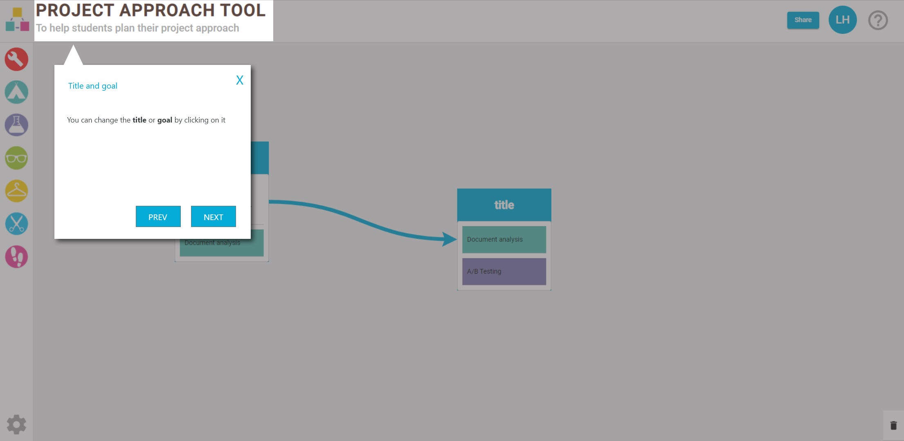
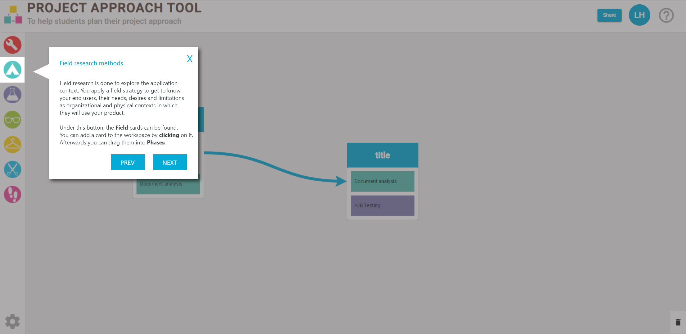

# Functional Design

#### Table of Contents
1. [Context](#Context)
    * [Goal](#Goal)
    * [Target audience](#Target-audience)
2. [Requirements](#Requirements)  
    * [Phase 1](#phase-1)  
    * [Phase 2](#Phase-2)
3. [Mockups phase 1](#Mockups-phase-1)
    * [Pages](#Pages-)
        * [Initial design workspace](#Initial-design-workspace)
        * [Second design workspace](#Second-design-workspace)
    * [Modals](#Modals-)
        * [Template selector](#Template-selector)
        * [Card selector](#Card-selector)
4. [Mockups phase 2](#Mockups-phase-2)
    * [Pages](#Pages)
        * [Registration page](#Registration-page)
        * [Login page](#Login-page)
        * [Workspaceslist page](#workspaceslist-page)
        * [Create workspace page](#create-workspace-page)
        * [Workspace page](#workspace-page)
    * [Popups](#Popups)
        * [Verify Email popup](#Verify-email-popup)
        * [Check mail for login link popup](#Check-mail-for-login-link-popup)
        * [Account settings popup](#Account-settings-popup)
        * [Workspace settings popup](#Workspace-settings-popup)
        * [Workspace add button popup](#Workspace-add-button-popup)
        * [Hover user popup](#Hover-user-popup)
    * [Modals](#Modals)    
        * [Share modal](#Share-modal)
        * [Revoke access modal](#Revoke-access-modal)
    * [Visual effects](#Visual-effects)
        * [Drag & drop](#Drag-&-drop)
5. [Mockups onboarding](#Mockups-onboarding)
6. [Use case diagrams](#Use-case-diagrams)
    * [Login and register](#Login-and-register)
    * [Workspace management](#Workspace-management)
    * [Grant and revoke access to a workspace](#grant-and-revoke-access-to-a-workspace)
    * [Online collaboration](#Online-collaboration)
    * [Application onboarding](#Application-onboarding)        
7. [Inspiration](#Inspiration)
    

# Context

## Goal
The main goal of this project is to help users with creating a project plan and make this process easier, by creating online versions of the DOT framework and ICT research methods card decks and by adding additional functionalities that will increase the speed, ease and quality of the project plan.

## Target audience
The target audience for this project consist of 2 main groups:

* HBO-IT Students
* Teachers / Professors

HBO-IT students are the biggest group of users for the platform and therefor the focus will lay on this group for the most part. an estimated guess would be that 95% of users will be a student.

We expect that both audiences have:

* general knowledge of computers
* general knowledge of researchmethods

# Requirements

## Phase 1

| *Requirements*                                                                                            | *MoSCoW* | *NF/F* |
|-----------------------------------------------------------------------------------------------------------|:--------:|:------:|
| The application must be a webapplication                                                                  |     M    |   NF   |
| The application must have backend(API)                                                                    |     M    |   NF   |
| The application must be easily usable for multidisciplinary users                                         |     M    |   NF   |
| The application must be support Chrome                                                                    |     M    |   NF   |
| The application should support Firefox,Safari and Microsoft Edge                                          |     M    |   NF   |
| The application must support desktop and laptop size screen                                               |     M    |   NF   |
| As a user I want to be able to create groups so I can assign cards to it.                                 |     M    |    F   |
| As a user I want to able to drag and drop the groups,  so I can organize them in order to fit the project |     M    |    F   |
| As a user I want to be able to edit and delete groups.                                                    |     M    |    F   |
| As a user I want to able to assign title into the groups, so I can easily identify them.                  |     M    |    F   |
| As a user I want to able to assign cards into the groups.                                                 |     M    |    F   |
| As a user I want to be able to click on thecard so I can reveal more information about them.              |     M    |    F   |
| As a user I want to able to move cards between groups, so I can organize them.                            |     M    |    F   |
| As a user I want to able to remove cards from the groups.                                                 |     M    |    F   |
| As a user I want to be able to browse the cards, so I can choose or view more information about them      |     M    |    F   |
| As a user I want to be able to create a custom card so I can personalize the tool for the project         |     M    |    F   |
| As a user I want to be able to choose a deck of cards, so I can look through them easier                  |     M    |    F   |
| As a user I want to able to receive question when I select card.                                          |     S    |    F   |
| As a user I want to be able to differentiate between the cards by the deck colors                         |     S    |    F   |
| As a user I should be able to select a template, so I can start planning easier and quicker.              |     S    |    F   |
| As a user I should be able to connect groups to each other with arrows                                    |     S    |    F   |
| As a user I should be able to login and save the current working space to my account.                     |     S    |    F   |
| The application must be easily usable for the users                                                       |     C    |   NF   |
| The user should be able to choose a template                                                              |     C    |    F   |
| The user must be able to use a blank working space                                                        |     C    |    F   |
| The user must be able to select a deck of cards                                                           |     C    |    F   |
| The user must be able to add their own cards                                                              |     C    |    F   |
| The user must be able to search through the available cards                                               |     C    |    F   |
| The user must be able to assign cards to groups                                                           |     C    |    F   |
| The user must be able to remove cards from the steps or question                                          |     C    |    F   |
| The user should be able to export and import the board                                                    |     C    |    F   |
| The user must be able to view information about cards                                                     |     C    |    F   |
| The user would be able to have an overview view of the project                                            |     C    |    F   |
| The user should be able to have an overview with DOT framework overview                                   |     C    |    F   |
| The user must be able to view extra information about the cards                                           |     C    |    F   |
| The user must be able to get questions when choosing a card                                               |     C    |    F   |
| The user should be able to add time needed, and deadline to the planning.                                 |     C    |    F   |
| The user should be able to add a boost to the cards                                                       |     C    |    F   |
| The user should be able to receive questions based on the already used cards                              |     C    |    F   |

## Phase 2

| *Requirements*                                                                                                                                                  | *MoSCoW* | *NF/F* |
|-----------------------------------------------------------------------------------------------------------------------------------------------------------------|:--------:|:------:|
| The security of the application should be correct according to the best practices                                                                               |     M    |   NF   |
| The owner of a workspace must be able to invite other users, so that they can work together on a workspace                                                      |     M    |    F   |
| The owner of a workspace must be able to kick other users out, so that he can revoke access if that is necassery                                                |     M    |    F   |
| The users must be able to see which users are active in a workspace, so that he/she knows who is work on the approach                                           |     M    |    F   |
| The workspace must be able to be updated in real time when changes are made to the workspace, so that users can work together real time                         |     M    |    F   |
| The user must be able to login, to access the workspaces.                                                                                                       |     M    |    F   |
| The user must be able to register and verify an account, so that they can log in to gain access to their workspaces                                             |     M    |    F   |
| The user must be able to see a list of multiple workspaces, so that they can know to which workspace they have accesss                                          |     M    |    F   |
| The user must be able to change a workspace, so that they can correct mistakes when necassery.                                                                  |     M    |    F   |
| The user must be able to delete a workspace, so that they can create a better overview of the list.                                                             |     M    |    F   |
| The user must be able to create a workspace, so that they can work on their approach.                                                                           |     M    |    F   |
| The application interface must meet the guidelines of material design, with google drive as a source of inspiration                                             |     M    |   NF   |
| The application cannot contain any errors                                                                                                                       |     M    |   NF   |
| The platform must by visual effect seperate the users, when the user commits an action. so that other users can see who is busy with what object.               |     S    |    F   |
| The user must be able to use independently                                                                                                                      |     S    |   NF   |
| The platform must contain a onboarding process, so that users get how the application works and so that they can use it independent.                            |    S     |    F   |
| As a user i want to be able to restart the onboarding proces, so that they can get a better understanding of the application                                    |     S    |    F   |
| As a user i want to be able to align the cards easily when dragging a card, so that it looks better                                                             |     S    |    F   |
| As a user i want access to a specific workspace(where i as user have been invited to) by means of a link, so that they can get quick access to their workspace  |     C    |    F   |
| The user must be able to select a card as favorite, so that they increase the speed of which a approach is made                                                 |     C    |    F   |
| The user must be able to filter out all the favorite card out of their respective list, so that they can use their favorites with ease.                         |     C    |    F   |
| As a user i want to be able to to create a custom methode or stepping stone if they do not exist, so that my approach is complete.                              |     C    |    F   |
| As a user i want to see the custom methodes in their respective list, so that i can find back the custom card                                                   |     C    |    F   |
| As a user i want to see the custom stepping stones in their respective list, so that i can find back the custom card                                            |     C    |    F   |
| as a user i want to see the hints about certain card, so that they can help the user further with their project approach                                        |     C    |    F   |
| As a user i want to see the history of a workspace, so that i can look back at it                                                                               |     W    |    F   |
| As a user i want to return to a certain time into the history of a workspace, so that i can redo certain steps.                                                 |     W    |    F   |
| As a user i want to see the questions about a certain card, so that they can help the user further with their project approach                                  |     W    |    F   |
| As a user i want a partly automatic en party answering questions measure my quality of the approach, so that it can help me improve my approach                 |     W    |    F   |
# Mockups phase 1
## Pages 

### Initial design workspace

my initial idea was to fully incorporate the DOT framework, build the whole user interface around that. After I showed the mock-ups to Danny, it turned out tobe wrong, because the interface should be more flexible, and less focused on DOT framework overview layout. At this point, I also understand that the application should be a standalone approach tool​, which ​includes ​the ​DOT framework ​principles. However, my mock still can be used for an overview, or for a report feature in a later stage. Based on thisfeedback, I draw a new design

### Second design workspace

This version already shows a more versatile interface. On the left, there is a toolbar, which will hold all the usable components of the application. In the middle, there is the “workspace”, in this specific design there is a predefined template. However, this part of the application can be also customised by the user, with the available components from the toolbar. In the top, there is a navbar with a few menu items, and thep roject name can be modified as well.

## Modals 
### Template selector

this version shows a pop-up the selection menu, upon startup, so the user can choose from various templates or an empty workspace.

### Card selector

This version shows the card selection popup menu. In this menu, the user can filter and search through the available cards. Click on the card would flip it, and show more detail about it, this may need to be changed because the stakeholders would like to see even more space for information. The mock-ups will gradually be updated based on feedback by the stakeholders.

# mockups phase 2
## Pages

### Registration page

This is the registration panel, here people can sign up so that they get access to the service. This platform will use a form of authentication without a password.

### Login page

This is the Login page, here people can log in so that they get access to the service. This platform will use a form of authentication without a password.

### workspaceslist page

This is the workspaces list page, here people can scroll through there workspaces and enter one by clicking. also people can go to the create workspace page by clicking the blue button with a white plus sign.

There are also a 3 little dots on each workspace in the list, this reveals the settings for a workspace. More information can be found [here](#Workspace-settings-popup).

Also can you see a blue user icon, this represents the login user. Here a user can change their information, find help and log out, More information about this can be found [here](#Account-settings-popup).

### create workspace page

Here people can create a new workspace by entering a title and a goal for the workspace. the user also needs to select a template, this can be a blank one or one that has been made by the user.

Also can you see a blue user icon, this represents the login user. Here a user can change their information, find help and log out, More information about this can be found [here](#Account-settings-popup).

### workspace page

This is the  workspace itself, here people can plan out their project approach by adding phases, groups, arrows and methods/questions by click the blue button with a white plus sign. More information about this can be found here [here](#Hover-user-popup).

There is also a line with different color circles these represents the users that are active in this workspace. More information about this can be found [here](#Hover-user-popup).

Next to these circles you can find a share button, here the owner can add new teammembers and also revoke access to members. More informatie about this can be found [here](#Share-modal).

Also can you see a blue user icon, this represents the login user. Here a user can change their information, find help and log out, More information about this can be found [here](#Account-settings-popup).

## Popups

### Verify email popup

When a user creates a account succesfully this screen will pop up, so that users know that an email has been sent to their account for verification.

### Check mail for login link popup

When a user logs in this screen will pop up, so that users know that a login link has been sent to their email, that they need to click on to get access to their account.

### Account settings popup

When a user is logged in and clicks on his profile, this popup will show up. showing the account he is logged in with and a couple of options a user can select out. he can update the settings and change his information, click help and logout.

### Workspace settings popup

When a user clicks the 3 little dots of a workspace, this popup is revealed. Here the user can do 3 things. update the workspace, make a template out of a workspace or delete the workspace.

### Workspace add button popup

When a user clicks on the blue button with a white plus sign, this popup is revealed. Here the user can add objects to the workspace. a user can add phases, questions, methods, stepping stones, arrows and custom cards.

### Hover user popup

This is an interaction when a user hovers over the profiles of users that are active in a workspace. each color is given to a unique user. This popup displays the full name of a user and also the email.

for more information about the adding of a user can be found [here](#Share-modal).

for more information about the visual effects that are bound to color can be found [here](#Visual-effects).

## Modals

### Share modal

When a user presses the blue button with the white share text, this modal pops up. On this screen the owner of the workspace can add additional users to the same workspace. 

when the user clicks the invite button, the users get an invite in their mail and they will displayed in the list, More information about this [here](#Share-after-invite-modal).
 

### Share after invite modal 

When a user added other users, they are added to the list above. Here the owner can press the X button to revoke their access, more information about this modal can be found [here](#Revoke-access-modal).

### Revoke access modal 

This modal pops up when the owner wants to revoke access to the workspace to one of its user.

## Visual effects

### Drag & drop

So when users work together on their approach, there has to be some way to visually distinguse between the different users. here when a user drags an object their will be a coloured effect around the object, so that other users can see that someone is busy with that object.

# Mockups onboarding

# Use case diagrams

## Login and register

**Registration**  
When a user wants to register an account, the user needs to fill in his full name and his email adress, then the availability of the email account will be checked so that double accounts cannot get created and if this instance occurse then an error will be displayed after that the registration get finalized and a screen popups stating that a confirmation email has been sent to the email of the user, that way we can check if the user is really the owner of the email account. In the email there is a link containing a confirmation link that has to be pressed so that the account gets activated.

**Login**  
When a user wants to login with his account, the user needs to fill in his email adress. then his credentials get verified and if they are incorrect an error will be displayed and else a screen will pop up stating that a login link has been sent to the users email so that other parties cannot login with the users credentials. In this link there is a login link that the user has to click on so that they get remember as logged in.

## Workspace management

**Create workspace**  
When a user wants to create a new workspace then has to provide a workspace title, goal and has to select a template. This data has to be provided to create a workspace, else a error will be displayed.

**Update workspace**  
When a user wants to update a workspace then the user has to adapt the workspace title or goal. both fiels have to be filled in, else a error will be displayed.

**Remove workspace**  
So the workspaces work a little different, because a workspace can be shared to other users. So before we will delete the workspace we first will check how many people the workspace has been shared too, is the number is 0 then the workspace can get deleted else the workspace gets removed for the specific user and the rest keep the workspace.

**Make template**  
A user can create a template out of its workspace, this is especially useful if you want to do projects in a specific way.

## Grant and revoke access to a workspace

**Granting access to a workspace**  
When a workspace owner wants to invite other users to join their workspace, they can add the user by entering a email into the invite field, after clicking invite the users will be checked if they have an account, if they exist they get an email containing a invite to the workspace. when they accept the invite they get redirected to the workspace and the user gets access to the workspace from now on.

**Revoking access to a workspace**  
When a workspace owner wants to revoke a users access, they can do so by pressing the red X's that is placed behind the users name in the invite modal. after the owner presses this button they get a modal asking for confirmation about revoking of access, if the user presses no, nothing happend. if they press yes, the access for that user gets revoked and they get no longer access to the workspace.

## Online collaboration

When a user makes a change, the workspace gets updated and the changes are sent to the cluster of users. after the changes are sent, the other users will recieve the changes automatically and the screen gets updated immediatly.

## Application onboarding

**New user**  
When a new user gets into the application,there will be a check if its the users first time into the application, in this case its a yes and therefor the application onboarding process starts, during the onboarding process the user gets an option to skip the onboarding process and an option to continue with the onboarding process.  

**Old user**  
An old user logs in and there will be a check if it is the users first time into the application, in this case it is a no and therefor the onboarding process is skipped.

**Restart onboarding process**  
An old user has the option to restart the onboarding process, if the user choses to do so the entire process starts from the beginning and a user has an option to skip the process.
# Inspiritation

The following tools have been looked at as a source of inspiration:

|    *Tool name*    |                                                                                             *Description*                                                                                            |
|:------------:|:----------------------------------------------------------------------------------------------------------------------------------------------------------------------------------------------------:|
| LucidChart   | lucidchart has a complex user interface for creating complex diagrams. Of course, our application requires a way cleaner and more focused interface, however, this also has flexible “working space” |
| Trello       | Trello is a well-known and widely used Scrum board application. Their interface is clean and easy to use, therefore it can be a good example for this project.                                       |
| Draw io      | Draw Io is a very similar tool to lucidchart, but they are open-source                                                                                                                               |
| Google Drive | for online collaboration we take inspiritation from google drive, as they have a lot of functionalities that are similair to our project                                                             |
| Google Keep  | Google keep has been a source of inspiritation when it comes to the looks of the card                                                                                                                |
