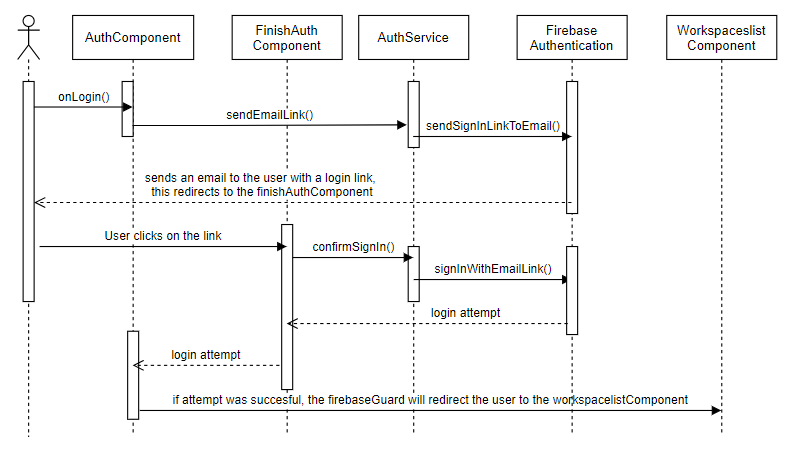
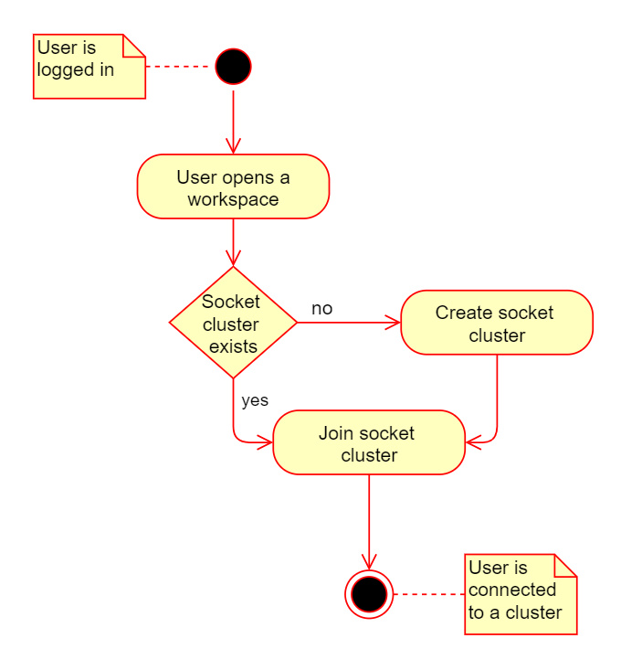
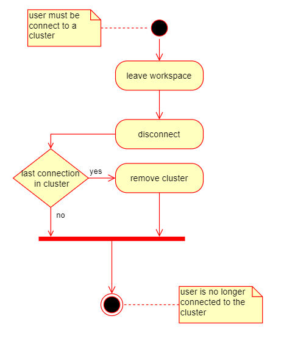

# Technical Design

#### Table of Contents

1.  [Software architecture](#Software-architecture)
2.  [Component hierachy](#Component-hierachy)
3.  [Models](#Models)
4.  [Authentication](#Authentication)
    * [Comparing services](#Comparing-services)
5.  [Sockets](#Sockets)
    * [How it works](#How-it-works)
    * [Comparing libraries](#Comparing-libraries)
    * [Implementation](#Implementation)
6.  [Onboarding](#Onboarding)


# Software architecture


**Presentation layer**

There are parts present in the presentation layer such as components, guards, interceptors and models. The guards monitor a route and are used to allow or deny access to a specific route. Consider, for example, logging in, if a user is not logged in, he should not be able to access the pages intended for users who are logged in.
The interceptors are used to modify the outgoing requests, in this case by adding an authentication code to the header of the request, when the user is logged in. This gives the application access to data from the server.

Furthermore, the presentation layer also contains services, with these services requests can be sent to the routes in the service layer and there are also models present, these models are used to handle the typing in typescript and they are identical to the models in the data access layer.

**Service layer** 

The service layer consists mostly of nodeJS routes, Routes are used to forward requests to the corresponding controllers, controllers are explained better in the next layer.
There is also swagger functionality in the service layer, which generates OpenAPI 2.0 specification. These specifications are used to describe APIs.
The service layer also contains an auth module, this is a module with which the routes are secured. Namely, an authentication code in the header is sent along by the interceptor in the presentation layer. The auth module checks the authentication code and then the request is forwarded to the route, if the code is approved and if it is not approved, the request is rejected.
The service layer also contains a socket module, this module contains all functionality related to the sockets, more information about the operation of these sockets can be found in chapter Online collaboration.

**Data access layer**

The data access layer is the connection between the mongoDB database and service layer. The routes from the service layer will forward requests to the controllers in the data access layer, so that these requests can be handled and a response can be returned.

# Component hierachy


# Models


**Card**  

* **id**   
The id is used to make cards unique on the workspace, this is necassery to apply effects in case of online collaboration.
* **shortDescription**   
This is a short description, to explain a card.
* **longDescription**   
This is a long description, to explain a card in more detail.
* **type**   
This value represents the card type
* **note**   
Notes are kept so that a user can add on additional information
* **picture**   
This is the picture that is displayed on the card
* **color**   
This is the color of the card
* **reflectiveQuestions**   
These are the reflective questions that each card has

**Deck**

* **title**   
This is the title of a deck
* **shortDescription**   
This is a short description for the deck
* **types**   
These are the inner-types each deck contains

**User**

* **uid**   
This is the uid of the firebase account that makes a user unique
* **firstName**   
The firstname of the user
* **lastName**   
The lastname of the user
* **email**   
The email of the user
* **school**   
The school the user goes to
* **study**   
The study the user follows at the school

**Template**

* **groups**  
These are the groups/phases that are in a template  
* **storedLines**   
These are the lines that are in a template
* **title**  
This is the title of a template 
* **goal**   
this is the goal of a template
* **image**   
this is the image of a template
* **spawnList**   
this is the spawnlist of a template
* **customCards**   
this a list of custom cards in a template
* **decks**   
this is a list of all decks active in a template

**Workspace**

* **groups**  
These are the groups/phases that are in a workspace   
* **storedLines**   
These are the lines that are in a workspace
* **users**   
this is a list of the users that have permission to get access to the workspace
* **title**   
this is the title of a workspace
* **goal**   
this is the goal of a workspace
* **image**   
this is the image of a workspace
* **spawnList**   
this is the spawnlist of a workspace
* **customCards**   
this a list of custom cards in a workspace
* **decks**   
this is a list of all decks active in a workspace

**Line**

* **id**
this is de id of a line
* **start**
this is the start location of the line
* **end**
this is the end location of the line

# Authentication

## Comparing services

|                      |    AWS Cognito     |         Auth0          |                      Okta                       |              Firebase Authentication               |
| :------------------: | :----------------: | :--------------------: | :---------------------------------------------: | :------------------------------------------------: |
|  Entry level price   |        Free        |          Free          |                      Free                       |                        Free                        |
|  Free active users   |       50.000       |         7.000          |                      1.000                      | Unlimited except for phone authentication (10.000) |
|  Passwordless login  | Unofficial support | Official support(free) | Official support(but only for paying customers) |               Official support(free)               |
|    Ease of use\*     |        7.1         |          8.5           |                       9.2                       |                        9.0                         |
|   Ease of setup\*    |        8.3         |          8.2           |                       8.7                       |                        9.0                         |
|   Ease of admin\*    |        8.3         |          8.6           |                       9.1                       |                        9.0                         |
| Quality of support\* |        6.9         |          8.6           |                       8.6                       |                        8.1                         |
| Product Direction\*  |        6.9         |          8.0           |                       8.2                       |                        8.4                         |

<br/>
In the end, firebase comes best out the comparison and leaves us room for further expansion.

## How it works



the user enters an email and clicks on login, a sign in link is sent from the firebase authentication service to the given email. <br/>
The user clicks on the link and this will redirect the user to the finishAuthComponent. Here the user can give extra information if it is his first time, <br/>
else it will confirm the sign in and then redirect back to the AuthComponent, A guard checks if the user is logged in and will automatically <br/>
redirect the user to the WorkspaceListComponent.

# Sockets

## How it works

**Joining workspace**  


if a user wants to open a workspace, there will be a check if the cluster exists. if it exists a user will join the cluster. if it not exists then it will create the cluster and join it.

**Updating workspace**  


now that the user is connect to a cluster. the user can make changes to a workspace. these changes will be updates in the database and the changes will be sent to the other users that are connected.

Below there will be more information:


so in this workspace 4 groupmembers are active. if user 1 will make a change to the workspace. it will emit the change and a broadcast will be performed and the change will be sent to all other member within the cluster.

if the recieving end fails to recieve the change, it will resend the change to that user only.

**Leave workspace**  


if a user wants to leave a workspace, they can do that by using different means: logging out, switching page, or leave the website. if a user uses any of these forms, the cluster will be left, if he is the last user within the workspace it will also remove the cluster.

## Implementation

**Emit**

```
  connectSocketToRoom(room: string, uid: string): void {
    this.socket.emit("connectRoom", { room, data: uid });
  }
```

for each emit a method is created in the socket service, this will sent the data to the event.

**Event observer**

```
  on(event: string): Observable<any> {
    return new Observable((observer) => {
      this.socket.on(event, (data) => {
        observer.next(data);
      });
    });
  }
```

this method listens to all given events and creates an Observable for it. you can then call upon these events like so:

```
    this.socketService.on("moveGroup").subscribe(async (res) => {
      this.workspace.groups.find((group) => group.id === res.id).location =
        res.location;
      this.updateArrows();
    });
```

moveGroup is one of the events and it is used to move the group to another position. Below here is a list of all possible events.

**Possible events**

|             Event             |                             Description                             |
| :---------------------------: | :-----------------------------------------------------------------: |
|           moveGroup           |   this event sents a group with a new location to the other users   |
|       updateGroupTitle        | this event sents a group with a new group title to the other users  |
|     updateWorkspaceTitle      |  this event sents a workspace with a new title to the other users   |
|      updateWorkspaceGoal      |   this event sents a workspace with a new goal to the other users   |
|      addCardToSpawnlist       |             this event sents a card to the other users              |
|        moveCardToGroup        |             this event sents a card to the other users              |
|      addGroupToWorkspace      |           this event sents a new group to the other users           |
|      addArrowToWorkspace      |           this event sents a new arrow to the other users           |
|     updateQuestionInGroup     |       this event sents a updated question to the other users        |
| updateCardPositionWithinGroup |         this event sents a updates list to the other users          |
|   updateQuestionInSpawnlist   |       this event sents a updated question to the other users        |
|      removeCardFromGroup      |        this event sents a card to remove to the other users         |
|    removeCardFromSpawnlist    |        this event sents a card to remove to the other users         |
|   updateNoteInSpawnlistCard   |             this event sents a card to the other users              |
|     updateNoteInGroupCard     |             this event sents a card to the other users              |
|          removeGroup          |        this event sents a group to remove to the other users        |
|       setEffectOnGroup        |   this event sents a group to put an effect on to the other users   |
|     removeEffectFromGroup     | this event sents a group to remove an effect off to the other users |
|        setEffectOnCard        |   this event sents a card to put an effect on to the other users    |
|     removeEffectFromCard      | this event sents a card to remove an effect off to the other users  |
|       setEffectOnTitle        |    this event sents color to put on the title to the other users    |
|     removeEffectFromTitle     |     this event removes the color off a title to the other users     |
|        setEffectOnGoal        |    this event sents color to put on the goal to the other users     |
|     removeEffectFromGoal      |     this event removes the color off a goal to the other users      |
|          connectRoom          |              this event connects the socket to a room               |
|           leaveRoom           |            this event disconnects the socket from a room            |
|        closeConnection        |                    this event closes the socket                     |

<br/>

# Onboarding

## Comparing libraries

|                  Functionalities                   |   ngx-tour   | ngx-joyride  | bdc-walkthrough |
| :------------------------------------------------: | :----------: | :----------: | :-------------: |
|         possible to go back into the tour          |     YES      |     YES      |       NO        |
|             possible to close the tour             |     YES      |     YES      |       NO        |
|            possible to restart the tour            |     YES      |     YES      |       YES       |
|                Life cycle callbacks                | YES(limited) |     YES      |       YES       |
|              Makes use of an overlay               |      NO      |     YES      |       NO        |
|   Makes it possible to go through multiple pages   |      NO      |     YES      |       NO        |
|   Makes it possible to change the styling easily   |     YES      | YES(limited) |       YES       |
| Makes it possible to change the location of a step |      NO      |     YES      |       YES       |

ngx-joyride, became the best option out of the comparison.

## Implementation

```
      this.joyrideService
        .startTour({
          steps: ["step1", "step2", "step3", "step4", "step5"],
        });
```

This is how the tour is started. the steps given to the array are the joyrideSteps given to elements you want to highlight like:

```
<div
  joyrideStep="step1"
  title="Welcome {{ fullName }},"
  [stepContent]="step1Content"
  stepPosition="center"
></div>
```

so the joyrideStep is the name in the startTour of the joyrideService,  
title is the title of the step and stepPosition is given to steps that do not hightlight any elements,  
the stepContent is shown below:  


```
<ng-template #step1Content>
  <br />
  This is your first time using this application, <br />
  this tour will explain the entire application. <br />
  <br />
</ng-template>
```
this is the text that will be shown in the step. the result will become:


  
for more information about the library see : <a href="https://www.npmjs.com/package/ngx-joyride">ngx-joyride</a>.
